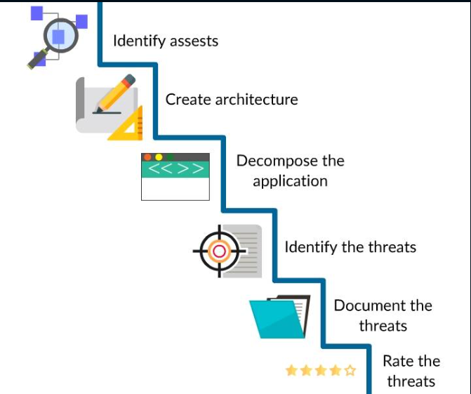
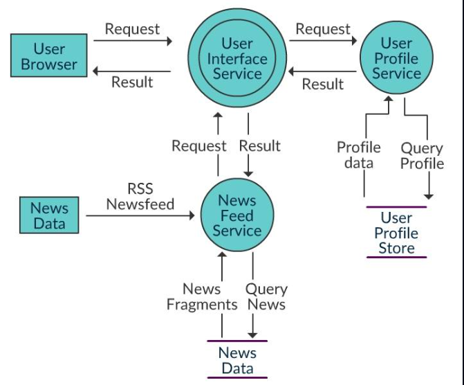
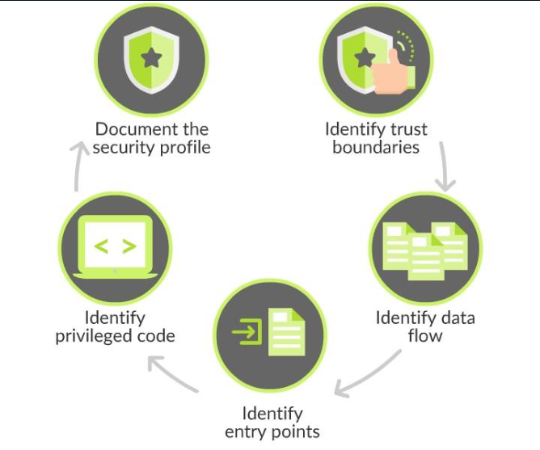

##### Threat Modeling: Prologue

_Welcome to the world of digital security._

_This course will help you gain an understanding of  **Threat Modeling**, its significance in digital security, the processes, and methodologies of threat modeling and some commonly used threat modeling tools._


##### Before You Begin

Before diving into the details of threat modeling, it is essential to understand the following basic terminology:

-   **Asset**: A resource of value, such as the data in a database or on the file system.
-   **Threat**: A potential occurrence, malicious or otherwise, that might damage or compromise assets.
-   **Vulnerability**: A weakness in some aspect or feature of a system that makes a threat possible.
-   **Attack (or exploit)**: An action taken by someone or something that harms an asset.
-   **Countermeasure**: A safeguard that addresses a threat and mitigates risk.


##### Significance of Threat Modeling

> _A  **threat**, in the context of computer security, refers to anything that has the  **potential to cause serious harm**  to a computer system._
> 
> _A threat is something that  **may or may not happen**, but has the potential to cause serious damage._

Software attacks, theft of intellectual property, identity theft, sabotage, and information extortion are examples of information security threats.

----------

In recent years, owing to the surge in cyber attacks, it has become vital for businesses and organizations to identify threats in their environment to develop effective strategies to curb the repercussions.


##### Threat Modeling

> _**Threat modeling**_  _can be defined as a family of activities for  **enhancing security**  by  **identifying objectives and vulnerabilities**, and then  **defining countermeasures**  to prevent, or mitigate the effects of the threats to the system._

In simple words, threat modeling is a planned activity for recognizing and evaluating application threats and vulnerabilities.

Threat modeling can be applied to a wide range of applications, including software, systems, networks, distributed systems, components of the internet of things, and business processes.


##### Need of Threat Modeling

-   Identifying security flaws at the earliest helps reduce overheads.
-   Helps save time, resources and the reputation of the organization.
-   Helps build reliable applications.
-   To bridge the gap between development and security.
-   Aids in efficient documentation of identified threats, security flaws, and solutions.
-   Helps develop an awareness of the latest risks and vulnerabilities.


##### What is in a Threat Model?

**Usually, a threat model incorporates the following details:**

-   A description/design/model of issues to be concerned about.
-   A list of assumptions that can be examined or challenged in the future as the threat landscape changes.
-   A list of potential threats to the system
-   A list of actions to be taken for each threat
-   Strategies to validate the model and threats
-   Analysis of actions taken


##### The Four Questions

The essence of threat modeling can be expressed using the following four questions.

-   **What are you working on?**
    -   Identify the assets and the attack vectors (entry/exit points).
-   **What can go wrong?**
    -   Identify threats: Anything that can compromise an asset is a threat.
-   **What are you going to do about it?**
    -   Mitigate the threats and reduce risk.
-   **Did we do a good job?**
    -   Analyze the previous steps.

To determine if an application is satisfactorily secure or not, combinations of these ingredients need to be analyzed.

##### Steps in Threat Modeling



The threat modeling process comprises the generic steps illustrated in the picture above.

The process of researching the search space is iterative and constantly refined by analyzing the feedback from previous iterations.


##### Identify Assets

The first step is to understand what's at stake.

-   Identifying tangible assets, like databases or sensitive files is usually easy.
    
-   Understanding the capabilities of an application and valuing them is challenging.
    
-   Less concrete things, such as reputation and goodwill are the most difficult to measure but are often the most critical.


##### In Architectural Overview

The key focus in creating the architectural overview is to find potential vulnerabilities in the design and implementation of the application.

The following are key factors to be considered:

-   Identify the functionality of the application.
-   Draft an architecture diagram.
-   Identify the technologies.


##### Decompose the Application



The application is broken down with respect to the processes, including all the sub-processes that make up the application.

Drafting a Data Flow Diagram (DFD) simplifies the procedure.

The image above illustrates a simple DFD of a News Feed Service.

> _The more you understand about the mechanics of your application, the easier it is to uncover threats._



_The image above lists the basic steps that help in decomposing the application_


##### Identify the Threats

In this step, the threats that might compromise the integrity of the assets are identified.

The members of the development and test teams are gathered to conduct an informed brainstorming session.

The following tasks are performed in this step.

-   Identifying network threats.
-   Identifying host threats.
-   Identifying application threats.

> Ideally, the team consists of application architects, security professionals, developers, testers, and system administrators.


##### Document the Threats

The anticipated attack technique and countermeasure required needs to be listed for each of the identified threats.

_A template similar to the example below is used in which several target attributes are clearly described._


Threat Description	| Attacker obtains authentication credentials by monitoring the network

Threat target		| Web application user authentication process

Risk				|**`High`**

Attack techniques	|Use of network monitoring software

Countermeasures	    | Use SSL to provide encrypted channel


##### Rating threats

Threats can be rated using a standard method called  **DREAD**.

It takes into account the following items:

-   **Damage potential**  (How much are the assets affected?)
-   **Reproducibility**  (How easily the attack can be reproduced?)
-   **Exploitability**  (How easily the attack can be launched?)
-   **Affected users**  (What’s the number of affected users?)
-   **Discoverability**  (How easily the vulnerability can be found?)

The threats are rated by answering the above questions and assigning values for every item (high, medium, low).

[Click here](https://resources.infosecinstitute.com/qualitative-risk-analysis-dread-model/#gref)  to learn more about DREAD.


##### Rate the Threats

In the final step of the process, the threats are rated based on the risks they pose.

This aids in addressing the threats that present higher risks first, and then resolve the other threats.

> It may not be economically viable to address all of the identified threats, some of them may even be ignored because the chance of them occurring is small and the damage that would result if they did is minimal.

```sh
Risk = Probability * Damage Potential

```

The formula above helps in determining risk which in turn indicates the consequences to a system if an attack were to occur.


##### Generating a Work Item Report

A more formalized work item report can be created from the initial threat model that can include additional attributes.

In this step, each of the threats that were rated is prioritized and fixed. Then the threat modeling process is restarted.

Threat Description | Attacker obtains authentication credentials by monitoring the network

Attack Techniques |Use of network monitoring software

Counter Measures |Use SSL to provide encrypted channel

Status | **`SSL Implemented`**

##### The Output

The output of the threat modeling process is a document that may be used by the different members of a project team.

It helps to gain a clear picture of the threats that need to be addressed and how to address them.

Threat models consist of a definition of the architecture of the application and a list of threats for the application scenario.

