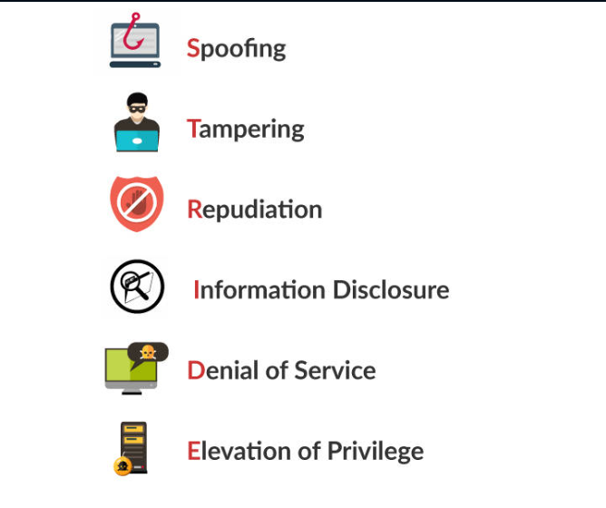
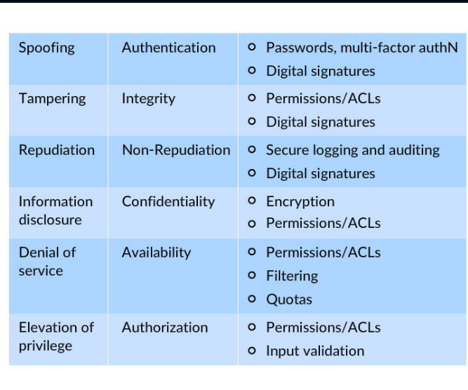
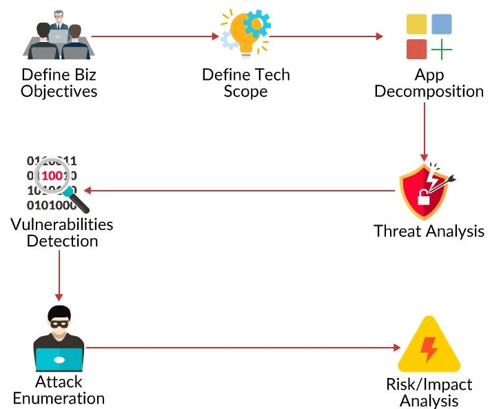
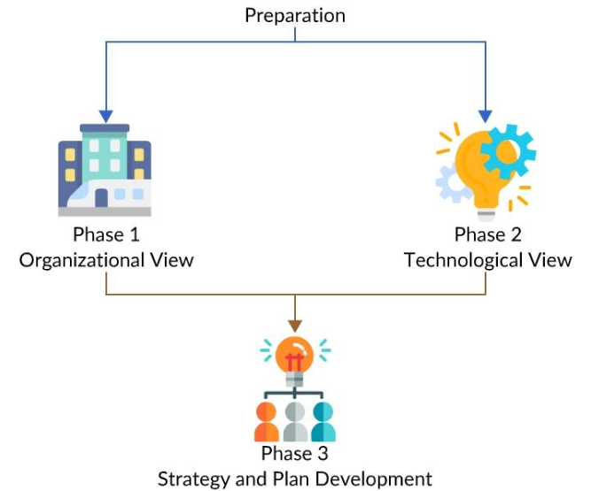
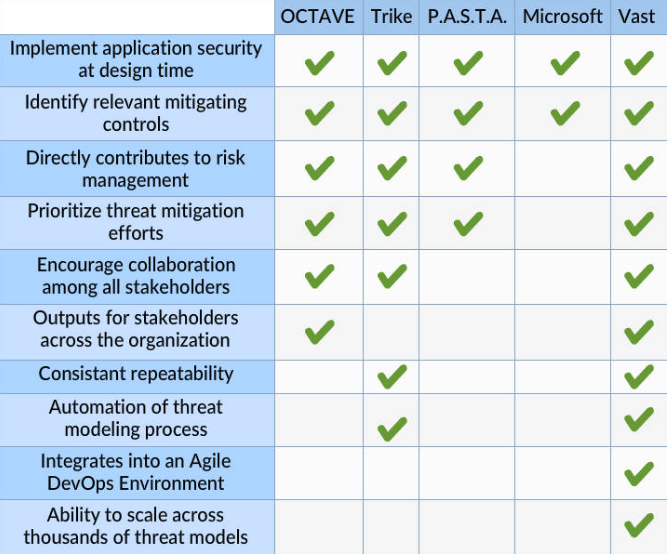
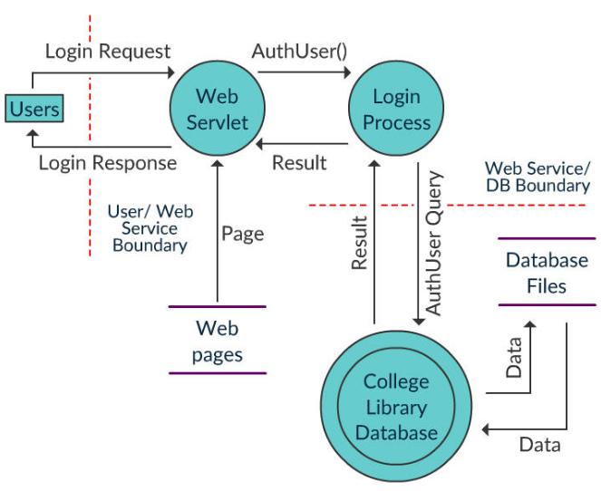
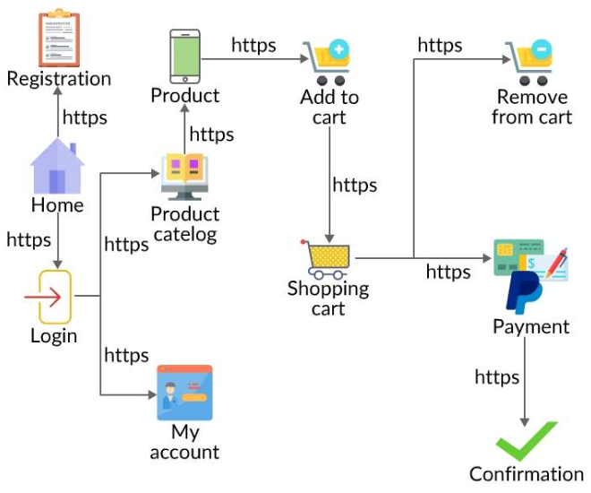
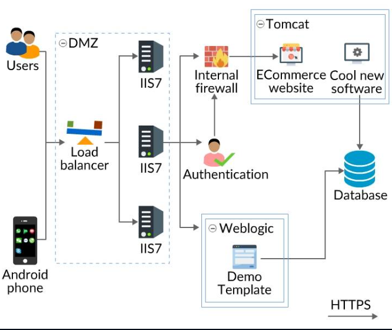

##### Threat Modeling Methodologies

Conceptually a threat modeling practice flows from a methodology. Numerous threat modeling methodologies are available for implementation.

The five most well-known methodologies are:

-   **STRIDE**
-   **PASTA**
-   **Trike**
-   **VAST**
-   **OCTAVE**

##### STRIDE Methodology

STRIDE is a model of security threats developed by  _Praerit Garg_  and  _Loren Kohnfelder_  at Microsoft.

It is a model of threats, used to help analyze and find threats to a system.

It provides a mnemonic for security threats under six categories.

> Each threat is a violation of security property.

##### STRIDE: What Can be Done?

_The table above illustrates the attributes of STRIDE, the security property violated by each threat, and what can be done to overcome the threat (Mitigation approach).

##### PASTA

**P**rocess for  **A**ttack  **S**imulation and  **T**hreat  **A**nalysis

-   Seven-step, risk-centric methodology.
-   Aims at aligning business objectives and technical requirements.
-   The intent of the method is to provide a  **dynamic threat identification**,  **enumeration**, and  **scoring**  process.
-   Intends to provide an attacker-centric view of the application and infrastructure from which defenders can develop an asset-centric mitigation strategy.

> The prime aim of PASTA is to address the most viable threats to a given application target.

##### The Seven Steps

_The image above illustrates the seven steps of PASTA methodology._

##### Trike

Trike threat modeling is an open source threat modeling methodology focused on satisfying the  **security auditing process**  from a cyber risk management perspective.

A  **"requirements model"**  is the foundation of the methodology. The requirements model guarantees that the assigned level of risk for each asset is acceptable to the stakeholders.

The Trike threat modeling methodology uses DFDs to illustrate the flow of data and the functions of end users.

-   A trike threat model is generated by analyzing the implementation model.
    
-   Using the threat model, appropriate risk values are assigned to each threat identified and then attack graphs are generated.
    
-   Mitigating controls are assigned to address the threats and the risks associated.
    
-   Finally, a risk model is developed from the completed threat model based on assets, roles, actions, and threat exposure.

##### VAST

**VAST**:  **V**isual,  **A**gile, and  **S**imple  **T**hreat modeling.

The underlying principle of this methodology emphasizes the necessity of scaling the threat modeling process across the infrastructure and entire Software Development Life Cycle(SDLC) and integrating it consistently into an Agile software development methodology.

A distinguishing feature of the VAST threat modeling methodology is its practical approach.

The security concerns faced by the development team might be different from those of the infrastructure team. To efficiently handle the difference, VAST calls for two types of threat models:

-   **Application Threat Models**
-   **Operational Threat Models**

##### VAST: Threat Models

-   **Application Threat Models**  are intended for development teams and are solely intended for the application under consideration. The primary purpose is to:
    
    -   Identify the threats that the application may be vulnerable to.
    -   To enlighten the developers on mitigation strategies to address the threats starting with the creation of Process Flow Diagrams.
-   **Operational Threat Models**  allow organizations to visualize the infrastructure risk profile
    
    -   Enhances the understanding of the full attack surface for key stakeholders.
    -   Helps organizational leaders equip themselves plan and prioritize infrastructure risk mitigation strategies.
    

##### OCTAVE

**OCTAVE:**  **O**perationally  **C**ritical  **T**hreat,  **A**sset, and  **V**ulnerability  **E**valuation methodology

OCTAVE threat modeling methodology focuses on assessing (non-technical) organizational risks that may lead from breached data assets.

Utilizing this threat modeling methodology, information assets of an organization are recognized and the datasets they include get attributes based on the type of data stored.

OCTAVE threat modeling offers organizational risk awareness, and a robust, asset-centric view, the documentation can turn huge.

This method is most helpful when developing a risk-aware corporate culture. It is customizable to the risk environment and specific security objectives of an organization.

##### Octave Process: An overview

_The image above gives an overview of the phases in the Octave Process_

[Click here](http://www.itgovernanceusa.com/files/Octave.pdf)  to gain a comprehensive understanding of OCTAVE.

##### Choosing the Right Methodology

From a theoretical perspective, each methodology offers security teams and organizations the means to recognize potential threats and may seem indistinguishable.

However, on a practical level, threat modeling methodologies vary in quality, consistency, and value received for the resources invested.

##### Threat Modeling Processes

Usually, threat modeling processes start with creating a visual representation of the application and infrastructure being analyzed.

The application/infrastructure is broken down into various components to enhance the analysis.

Once completed, the visual representation can be used to identify and enumerate potential threats efficiently.

Threat modeling methodologies usually use two types of diagrams for visualization:

-   **Data Flow Diagrams (DFDs)**
-   **Process Flow Diagrams (PFDs)**

##### Data Flow Diagrams

Data Flow Diagrams (DFD) is the  **visual representation technique**  used by threat modeling methodologies like STRIDE, PASTA, and Trike.

DFDs were developed in the 1970s as a tool to illustrate the  **details of the**  **data flow process**  in an application, data storage, and manipulation by the infrastructure upon which the application runs.

Traditionally, DFDs utilize only four symbols:

-   **Data flows**
-   **Data stores**
-   **Processes**
-   **External entities**

At the beginning of the 2000s, an extra symbol,  **trust boundaries**, was added to allow DFDs to be exploited for threat modeling.

##### DFD Example

The image above illustrates a simple DFD drawn for a College Library application.

DFDs can be expressed at different levels. Level 0, also known as  **context diagram**  gives an overview of the application and the higher levels detail out the processes of the application.

##### DFD in Threat Modeling

Once the application-infrastructure system is expressed concerning the five elements, security experts analyze each identified threat entry point against all known threat categories.

Once the potential threats are enumerated, further steps for mitigation and analysis may be carried out.

##### Shortcomings of DFDs

DFD based threat modeling practices face the following shortcomings:

-   DFDs cannot represent the design and flow of an application accurately.
-   DFDs are not efficient in illustrating how users interact and traverse through the features of an application.
-   Data flow diagrams are found to be vague, complex, and harder to comprehend.
-   There is no standard approach to DFD based threat modeling - different threat models with contradicting outputs can be generated for the same application.
-   DFD based threat models are more effective in the analysis of high-level system issues.

##### Process Flow Diagrams (PFDs)

The VAST methodology creates a distinction between Application Threat Models (ATM) and Operational or Infrastructure Threat Models (OTM).

Application Threat Models are built with  **Process Flow Diagrams**.

PFD was developed in 2011 as a tool to let Agile software development teams to develop threat models on the basis of application design process.

-   Applications are decomposed on the basis of the  **component features or use cases**.
-   Each feature is enumerated in terms of the  **core building blocks**  required to construct that feature.
-   Features are then linked by  **communication protocols**.

> The resulting visualization known as a map of how a user navigates through the various features of an application.

##### Process Flow Diagram: ATM

_The image above illustrates the Process Flow Diagram of an e-Commerce site._

##### Threat Modeling Using PFDs

Process Flow Diagrams provide visualization in the  **viewpoint of an attacker**.

Generally, attackers are more concerned with sorting out ways to move through the application use-cases rather than on data flows.

> _The prime intention is to exploit simple use cases to gain access to assets._

----------

Hence the tool used to analyze such threats must help in recreating a similar thought process.

Such a design helps in deriving a more practical abuse-case analysis as well as makes the outcomes more appealing and viable to the development team.

##### Threat Model Diagram: OTM

OTMs are made up of end-to-end data flow diagrams that resemble traditional DFDs.

End to end data flow diagrams break down an application into its different independent, grouped, and shared components.

Each component is explained in terms of specific attributes.

Components are then connected by communication pathways and protocols.

##### Threat Modeling Tools

Some of the prominent tools used for organizational threat modeling are:

-   **Microsoft**’s free threat modeling tool
-   **ThreatModeler**  by MyAppSecurity
-   **IriusRisk**
-   **securiCAD**  by the Scandinavian company Foreseeti

##### Microsoft’s Threat Modeling Tool

-   This tool uses the Microsoft threat modeling methodology
-   DFD-based
-   Identifies threats based on the STRIDE threat classification scheme.
-   It is mainly intended for general use.

##### ThreatModeler

-   Utilizes the VAST methodology
-   PFD-based
-   Identifies threats on the basis of a customizable comprehensive threat library.
-   It is targeted for collaborative use across all organizational stakeholder.

##### IriusRisk

-   IriusRisk offers both a commercial and community version of the tool.
-   This tool focuses on the creation and maintenance of a live Threat Model throughout the SDLC.
-   It drives the process by utlizing fully customizable questionnaires and Risk Pattern Libraries. It connects with other various tools to empower automation.

##### securiCAD

It is intended for company cybersecurity management, from CISO to security engineer, to a technician.

securiCAD is intended for cyber security management of organizations

-   Conducts automated attack simulations to future and current IT architectures.
-   Identifies and quantifies risks comprehensively that includes structural vulnerabilities.
-   Offers decision support based on the findings.